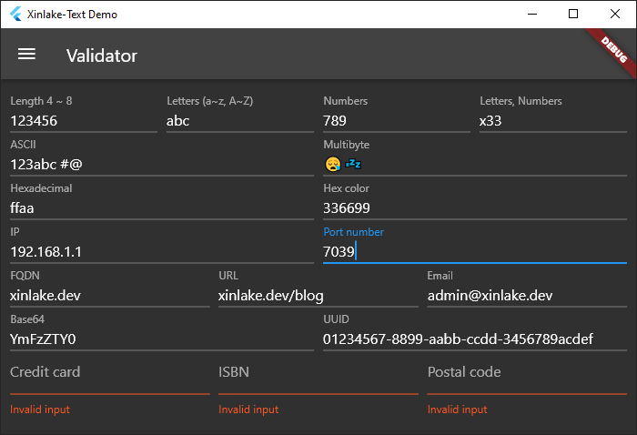
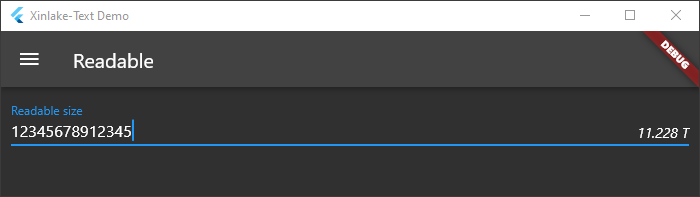

<!-- 
For information about how to write a good package README, see the guide for
[writing package pages](https://dart.dev/guides/libraries/writing-package-pages). 

For general information about developing packages, see the Dart guide for
[creating packages](https://dart.dev/guides/libraries/create-library-packages)
and the Flutter guide for
[developing packages and plugins](https://flutter.dev/developing-packages). 
-->

Text utilities.

## Features
### Validator

### Readable 

### Formatter

### Generator

## Open source software
[validators](https://github.com/dart-league/validators)
